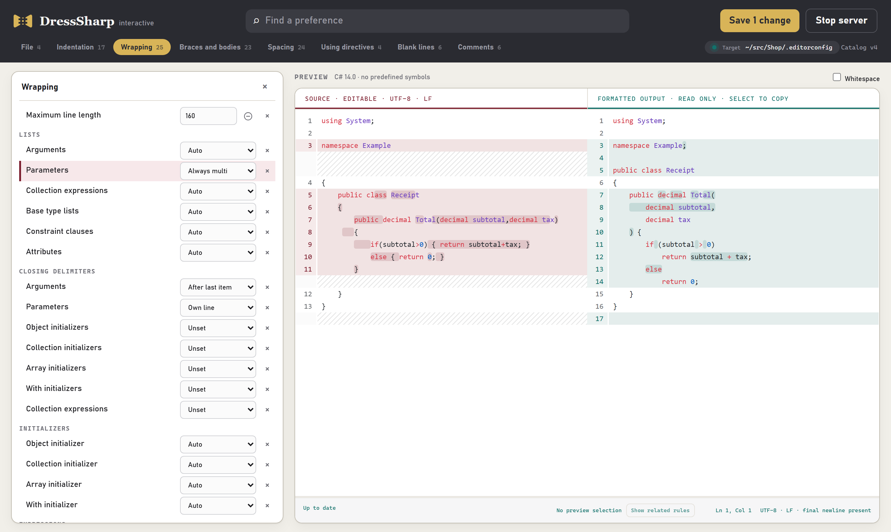

Each rule in DressSharp is one EditorConfig setting. `dotnet dress init` writes all of them with their defaults, and from then on the file is yours to change. There are two ways to do that.

## Try them on

```sh
dotnet dress interactive
```

This opens the nearest `.editorconfig` in your browser. The app runs entirely on your machine and never uploads anything. When you're done, click **Stop server** or press Ctrl+C in the terminal.



Pick a group of rules from the tabs along the top, or search for one by name. The preview on the right shows sample code on the left and, on the right, how it looks under the rules as they're currently set.

- **Use your own code.** Paste a file you actually work on over the sample. Nothing you paste is saved.
- **Change a rule and watch the preview.** The preview updates as you go. Each rule also has a small example of its own that shows what every value does.
- **Ask why a line moved.** Select some lines in the preview and click **Show related rules**. The list narrows to the rules that shaped those lines.
- **Tick Whitespace** to see the exact spaces, tabs and line endings.
- **Save** writes your changes into the EditorConfig. It changes only the settings you touched, so any edits made to the file in the meantime are kept.

To open a different file, pass it with `--config`:

```sh
dotnet dress interactive --config src/.editorconfig
```

## Edit the file

Your rules live in a plain `.editorconfig` file, so you can also change them in any text editor. The [rules reference](../rules/) lists every setting, with before-and-after examples for each value.

```editorconfig
[*.cs]
max_line_length = 120
dress_namespace_style = file_scoped
csharp_new_line_before_open_brace = all
```

A few things are worth knowing:

- **`unset` turns a rule off.** Setting a rule to `unset`, or leaving it out entirely, means DressSharp won't touch that aspect of your code at all. It doesn't fall back to a default.
- **Your existing settings count.** DressSharp reads the standard `csharp_*` and `dotnet_*` formatting settings the same way Visual Studio does. The `dress_*` settings cover what those don't, like how long lists wrap and where blank lines go.
- **Different folders can have different rules.** EditorConfig is applied per file, so a `.editorconfig` in a subfolder, or a more specific section like `[tests/**/*.cs]`, overrides the settings above it.
- **Severity suffixes are ignored.** A value like `true:warning` is read as `true`, so settings shared with code analysis work unchanged.
- **Mistakes are caught before anything is written.** An invalid value stops the run with an error before any file changes. Settings DressSharp doesn't recognise are ignored.

## Where to start

Most rules make small adjustments, but a few decide most of how your code looks. If `dotnet dress check` flags more files than you expected, look at these first:

- [`max_line_length`](../rules/wrapping/#max_line_length): where long lines start to wrap.
- [`dress_namespace_style`](../rules/braces-and-bodies/#dress_namespace_style): file-scoped or block namespaces.
- [`csharp_new_line_before_open_brace`](../rules/braces-and-bodies/#csharp_new_line_before_open_brace): whether braces go on their own line.
- [Body styles](../rules/braces-and-bodies/#dress_method_body): expression bodies (`=>`) or block bodies.
- [`indent_style` and `indent_size`](../rules/indentation/#indent_style): tabs or spaces, and how many.
